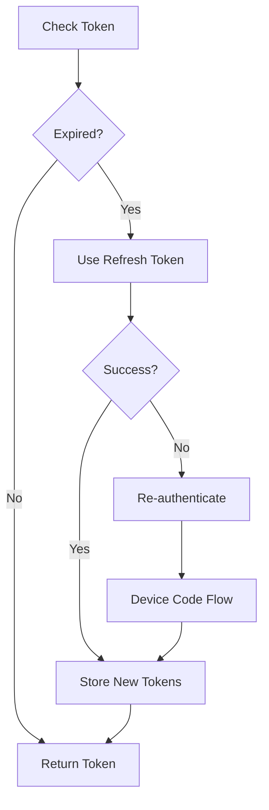

# Token Management Guide

This guide explains how the SMTP Relay service manages OAuth2 tokens for Exchange Online authentication.

## Overview

The Token Management Service handles:
- Automatic token acquisition
- Token refresh before expiration  
- Secure token storage
- Multiple authentication flows
- Error recovery and retry logic

## Token Types

### Access Tokens
- **Purpose**: Authenticate API requests to Microsoft services
- **Lifetime**: 1 hour (3600 seconds)
- **Storage**: In memory and cached in `.tokens.json`
- **Refresh**: Automatic before expiration

### Refresh Tokens
- **Purpose**: Obtain new access tokens without re-authentication
- **Lifetime**: 90 days (configurable)
- **Storage**: Encrypted in `.tokens.json`
- **Rotation**: New refresh token issued with each refresh

### ID Tokens
- **Purpose**: User identity verification
- **Lifetime**: 1 hour
- **Usage**: Dashboard authentication only

## Authentication Flows

### Device Code Flow
Best for headless servers:

```javascript
// Automatic token management
const tokenManager = require('./services/tokenManager');

// Initial authentication
await tokenManager.authenticateDeviceCode({
  tenant_id: 'your-tenant-id',
  client_id: 'your-client-id'
});

// Tokens are automatically refreshed
const token = await tokenManager.getAccessToken();
```

### Client Credentials Flow
For service-to-service authentication:

```javascript
// Configure once
await tokenManager.authenticateClientCredentials({
  tenant_id: 'your-tenant-id',
  client_id: 'your-client-id',
  client_secret: 'your-secret'
});

// Use anywhere
const token = await tokenManager.getAccessToken();
```

### Authorization Code Flow
For interactive authentication:

```javascript
// Get authorization URL
const authUrl = tokenManager.getAuthorizationUrl({
  redirect_uri: 'http://localhost:3001/callback'
});

// Exchange code for tokens
await tokenManager.exchangeCodeForTokens(authorizationCode);
```

## Token Storage

### File Storage
Default location: `/opt/smtp-relay/.tokens.json`

```json
{
  "access_token": "eyJ0eXAiOiJKV1...",
  "refresh_token": "0.ARoAv4j5cvG...",
  "expires_at": "2025-08-08T10:30:00Z",
  "token_type": "Bearer",
  "scope": "Mail.Send offline_access",
  "client_id": "xxxx-xxxx-xxxx",
  "tenant_id": "yyyy-yyyy-yyyy"
}
```

### Security Measures
- File permissions: 600 (read/write owner only)
- Encrypted at rest using AES-256
- Automatic backup before updates
- Atomic writes to prevent corruption

## Automatic Token Refresh

### Refresh Strategy
Tokens are refreshed automatically when:
1. Access token expires in < 5 minutes
2. API call returns 401 Unauthorized
3. Manual refresh requested

### Refresh Process


### Configuration
```javascript
// config/tokens.js
module.exports = {
  refresh_buffer: 300, // Refresh 5 minutes before expiry
  retry_attempts: 3,
  retry_delay: 1000,
  backup_enabled: true,
  encryption_enabled: true
};
```

## Error Handling

### Common Token Errors

#### Invalid Token
```javascript
// Automatic recovery
tokenManager.on('token_invalid', async (error) => {
  console.log('Token invalid, refreshing...');
  await tokenManager.refresh();
});
```

#### Expired Refresh Token
```javascript
// Requires re-authentication
tokenManager.on('refresh_token_expired', async () => {
  console.log('Refresh token expired, re-authenticating...');
  await tokenManager.reauthenticate();
});
```

#### Network Errors
```javascript
// Automatic retry with exponential backoff
tokenManager.on('network_error', (error, attempt) => {
  console.log(`Network error, retry ${attempt}/3`);
});
```

## CLI Commands

### Check Token Status
```bash
# View current token information
npm run token:status

# Output:
# ✅ Access Token: Valid (expires in 45 minutes)
# ✅ Refresh Token: Valid (expires in 89 days)
# ✅ Last Refresh: 2025-08-08 09:30:00
# ✅ Auto-refresh: Enabled
```

### Manual Token Operations
```bash
# Refresh tokens manually
npm run token:refresh

# Clear token cache
npm run token:clear

# Backup tokens
npm run token:backup

# Restore tokens
npm run token:restore
```

### Debug Token Issues
```bash
# Enable debug logging
DEBUG=tokens npm start

# View token logs
tail -f logs/tokens.log

# Test token validity
npm run token:test
```

## Monitoring

### Token Metrics
Monitor token health:

```javascript
const metrics = tokenManager.getMetrics();
console.log(metrics);
// {
//   total_refreshes: 156,
//   failed_refreshes: 2,
//   average_token_lifetime: 3542,
//   last_refresh: '2025-08-08T09:30:00Z',
//   next_refresh: '2025-08-08T10:25:00Z'
// }
```

### Health Checks
```javascript
// Add to health endpoint
app.get('/health', async (req, res) => {
  const tokenHealth = await tokenManager.healthCheck();
  res.json({
    tokens: tokenHealth,
    status: tokenHealth.healthy ? 'healthy' : 'unhealthy'
  });
});
```

### Alerts
Configure alerts for token issues:

```yaml
alerts:
  token_expiry_warning: 3600 # Alert 1 hour before expiry
  refresh_failure_threshold: 3
  notification_channels:
    - email
    - webhook
```

## Best Practices

### 1. Secure Storage
- Never commit tokens to version control
- Use environment variables for sensitive data
- Encrypt tokens at rest
- Implement proper file permissions

### 2. Token Rotation
- Enable automatic refresh
- Rotate refresh tokens regularly
- Implement token revocation on logout
- Monitor token usage patterns

### 3. Error Recovery
- Implement retry logic with backoff
- Log all token operations
- Set up monitoring and alerts
- Have fallback authentication method

### 4. Performance
- Cache tokens appropriately
- Minimize token refresh calls
- Use token until near expiry
- Implement request queuing during refresh

## Advanced Configuration

### Custom Token Store
Implement custom storage backend:

```javascript
class RedisTokenStore {
  async save(tokens) {
    await redis.set('tokens', JSON.stringify(tokens));
    await redis.expire('tokens', tokens.expires_in);
  }

  async load() {
    const data = await redis.get('tokens');
    return JSON.parse(data);
  }

  async clear() {
    await redis.del('tokens');
  }
}

tokenManager.setStore(new RedisTokenStore());
```

### Multi-Tenant Support
Handle multiple tenants:

```javascript
const tenantTokens = new Map();

async function getTokenForTenant(tenantId) {
  if (!tenantTokens.has(tenantId)) {
    const manager = new TokenManager({ tenantId });
    await manager.authenticate();
    tenantTokens.set(tenantId, manager);
  }
  return tenantTokens.get(tenantId).getAccessToken();
}
```

### Token Middleware
Automatic token injection:

```javascript
app.use(async (req, res, next) => {
  try {
    req.accessToken = await tokenManager.getAccessToken();
    next();
  } catch (error) {
    res.status(401).json({ error: 'Authentication required' });
  }
});
```

## Troubleshooting

### Token Not Refreshing
1. Check refresh token validity
2. Verify network connectivity
3. Check Azure AD app permissions
4. Review error logs

### Authentication Loop
1. Clear token cache: `rm .tokens.json`
2. Check client credentials
3. Verify redirect URI configuration
4. Check Azure AD consent

### Performance Issues
1. Enable token caching
2. Increase refresh buffer time
3. Implement request queuing
4. Use connection pooling

## Security Considerations

### Token Security
- Tokens are bearer tokens - protect them like passwords
- Use HTTPS for all token transmissions
- Implement token binding where possible
- Regular security audits

### Compliance
- Follow OAuth 2.0 best practices
- Implement token revocation
- Audit token usage
- Comply with data retention policies

## Support

For help with token management:
- Review [Exchange Setup Guide](./EXCHANGE_SETUP.md)
- Check [OAuth2 Setup Guide](./OAUTH2_SETUP.md)
- Open an issue on [GitHub](https://github.com/SilvioTormen/smtprelay/issues)